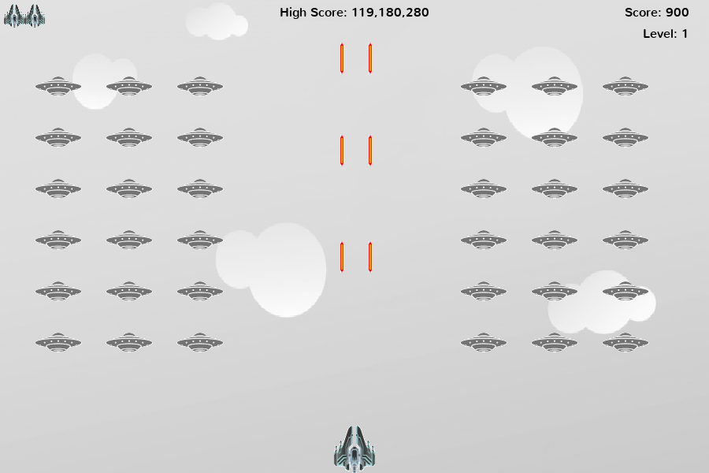
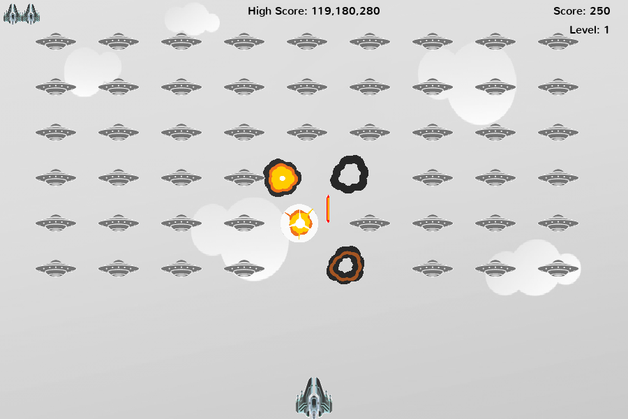

# Alien Invaders Game

Alien Invaders is a simple re-imagining of the classical 2D arcade game Space Invaders.

<!-- TOC -->

- [About](#about)
- [Installation](#installation)
    - [Requirements](#requirements)
    - [Running the Game](#running-the-game)
    - [Quick Game Guide](#quick-game-guide)
- [Project Structure](#project-structure)
- [To-do](#to-do)
- [Meta](#meta)
- [Contribute](#contribute)
- [Acknowledgements](#acknowledgements)

<!-- /TOC -->

## About

Alien Invaders is a shooter game in which the player controls a ship with lasers by moving it horizontally across the bottom of the screen and firing at aliens as they descend. The aim is to clear the screen of aliens, as they move horizontally back and forth across the screen, and vertically advance towards the bottom of the screen.

When the player shoots down an alien, points are earned. When the screen is cleared of all aliens, the game moves a level up. As the levels increase, the aliens advance faster. However, the ship also moves and shoots faster.

**In-game Screenshot:**



## Installation

### Requirements

| [`Python 3.6 +`](https://www.python.org/downloads/) |
| ---------------------------------------- |
| [`Pygame 2.0 +`](http://www.pygame.org/) |

### Running the Game

1) Clone this repo in your local machine with the command:

    ```bash
    git clone https://github.com/yatesmac/Alien-Invaders.git
    ```

1) Use the `cd` command to navigate to the main directory of the project.

1) Create a virtual environment and activate it (in Linux/Unix):

    ```bash
    python -m venv env
    source env/bin/activate
    ```

1) Install dependancies

    ```bash
    pip install -r requirements.txt
    ```

1) Navigate to the `alieninvaders` directory of the project and run the `alieninvaders.py` file:

    ```bash
    python alieninvaders.py
    ```

## Quick Game Guide

- The player controls the the left and right movements of the ship with the `Right` and `Left` Arrow keys.
- The `Space-bar` is for shooting missiles at the ships.
- Game sounds can be muted or unmuted by pressing the ` M ` key.
- By pressing `Esc` the player can exit the game.
- When all the alien ships have been cleared, the player's level increases.
- With every level up, the aliens, ship, and bullets all increase in speed.
- The score for shooting down each alien increases as well.
- The game permanently stores your all-time high-score.

**NOTE:** The shooter can only fire three pairs of missiles at a time, so they have to try and aim more accurately.



## Project Structure

```bash
.
├── alieninvaders
│   ├── alien_fleet.py
│   ├── alieninvaders.py
│   ├── alien.py
│   ├── bullet.py
│   ├── button.py
│   ├── color.py
│   ├── explosion.py
│   ├── game_stats.py
│   ├── __init__.py
│   ├── __main__.py
│   ├── scoreboard.py
│   ├── settings.py
│   └── ship.py
├── CHANGELOG.md
├── LICENSE
├── README.md
├── requirements.txt
└── resources
    ├── fonts
    │   ├── nunito_light.ttf
    │   └── nunito.ttf
    ├── images
    │   ├── alien.bmp
    │   ├── back.bmp
    │   ├── bullet.bmp
    │   ├── explosions
    │   │   ├── explosion00.jpg
    │   │   ├── explosion01.jpg
    │   │   ├── explosion02.jpg
    │   │   ├── explosion03.jpg
    │   │   ├── explosion04.jpg
    │   │   ├── explosion05.jpg
    │   │   ├── explosion06.jpg
    │   │   ├── explosion07.jpg
    │   │   └── explosion08.jpg
    │   ├── game_play
    │   │   ├── Alien-Invaders2.png
    │   │   ├── Alien-Invaders3.png
    │   │   └── Alien-Invaders.png
    │   └── ship.bmp
    ├── logs
    │   └── high-scores.txt
    └── sounds
        ├── alien_shot.wav
        ├── ship_hit.wav
        └── shoot.wav
```

## To-do

- [ ] The project documentation is not yet set up.
- [ ] Some features may be added in the future - such as aliens shooting missiles at the player ship.

## Meta

Yates Macharaga  – [ymacharaga@gmail.com](mailto:ymacharaga@gmail.com)

Distributed under the [MIT](https://choosealicense.com/licenses/mit/) license. See `LICENSE` for more information.

 [https://github.com/yatesmac](https://github.com/yatesmac)

## Contribute

If you'd like to contribute to Alien Invaders Project:

1. Fork it (https://github.com/yatesmac/Alien-Invaders/fork)
2. Create your feature branch (`git checkout -b feature/fooBar`)
3. Commit your changes (`git commit -am 'Add some fooBar'`)
4. Push to the branch (`git push origin feature/fooBar`)
5. Create a new Pull Request

## Acknowledgements

This repository is a project carried out as part of a study of the book *Python Crash Course: A Hands-on, Project-based Introduction to Programming* (Second Edition, 2021) written by *Eric Matthes*. I also incorporated new elements (such as game sounds, explosions, etc).
